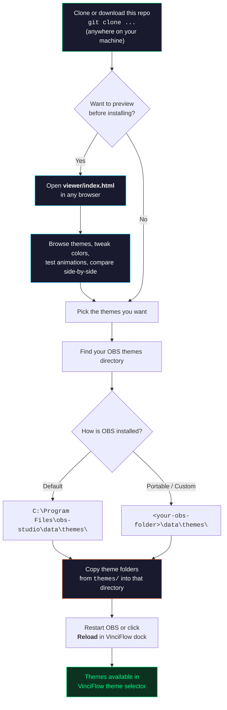

# NooRotic Stream Themes

Custom lower third templates for [VinciFlow](https://github.com/mmlTools/vinci-flow) — a broadcast-grade stream graphics controller for OBS Studio.

## How It Works



## Prerequisites

- [OBS Studio](https://obsproject.com/) 29+ (Windows 64-bit)
- [VinciFlow plugin](https://streamrsc.com/streaming-resource/vinci-flow) installed

## Quick Start

```bash
# 1. Clone this repo (anywhere — NOT inside OBS)
git clone https://github.com/NooRotic/noorotic-stream-themes.git
cd noorotic-stream-themes

# 2. Preview themes (optional — no OBS needed)
#    Open viewer/index.html in your browser

# 3. Copy the themes you want into your OBS VinciFlow themes directory
#    Find your OBS themes path:
#      Default install:   C:\Program Files\obs-studio\data\themes\
#      Portable install:  <your-obs-folder>\data\themes\

# Copy a single theme:
cp -r themes/neon-pulse "C:\Program Files\obs-studio\data\themes\neon-pulse"

# Or copy all themes at once:
cp -r themes/* "C:\Program Files\obs-studio\data\themes\"

# 4. Restart OBS or click "Reload" in the VinciFlow dock
```

> **Windows users:** Use `xcopy` or drag-and-drop in Explorer if you don't have `cp`. The key is to get each theme folder (e.g., `themes/neon-pulse/`) into your OBS `data/themes/` directory.

## Development Workflow

This repo is a **standalone project** — clone it anywhere, develop here, then deploy to OBS by copying:

```
~/projects/noorotic-stream-themes/    <-- You develop here (git tracked)
  themes/
    neon-pulse/
    breaking-news/
    scoreboard/
    ...
  viewer/
    index.html                        <-- Preview tool (open in browser)

C:\Program Files\obs-studio\          <-- OBS install (separate)
  data/themes/
    default/                          <-- VinciFlow built-in (don't touch)
    neon-pulse/                       <-- Copied from this repo
    breaking-news/                    <-- Copied from this repo
    ...
```

**Preview without OBS:** Open `viewer/index.html` in any browser to preview, compare, and tweak all themes with live controls.

## Themes

### Button Themes (compact, positioned anywhere)

| Theme | Style | Animated | Avatar |
|---|---|---|---|
| `network-bar` | CNN/Fox-style bottom bar, cyberpunk matrix palette | - | No |
| `anchor-card` | Dark card with avatar circle and left color stripe | - | Yes |
| `corporate-clean` | Light card, shadow, bottom accent gradient | - | Yes |
| `breaking-news` | Red pulsing BREAKING badge, high contrast | Pulse | No |
| `lower-doc` | Documentary dark bar, large title, fade-out rule | - | No |
| `breaking-bowltv` | BowlTV-branded breaking news with logo | Pulse | No |
| `neon-pulse` | Glowing border, breathing drop-shadows, neon flicker | Heavy | No |
| `tiedye-trip` | Psychedelic tie-dye swirl, rainbow text, color cycling | Heavy | No |
| `headline-ticker` | Auto-cycling headlines, orbiting glow, LIVE badge | Heavy | No |

### Specialty Themes (interactive, data-driven)

| Theme | Style | Data Bindings |
|---|---|---|
| `scoreboard` | Dual-team scoreboard with glowing digits, VS center, ticker | `team1`, `team2`, `score1`, `score2`, `round`, `status` |
| `poll-results` | 4-option live poll with animated progress bars | `opt1label`, `opt1pct`, `opt2label`, `opt2pct`, etc. |
| `countdown` | Self-contained timer with blinking colons and progress bar | `target` (ISO date) or `duration` (seconds) |

### Wide Themes (full-width, bottom of screen)

Each button theme has a `-wide` variant that spans `100vw` with:
- Original card embedded on the left
- Static headline area
- Scrolling ticker bar underneath with branded label

| Theme | Ticker Style |
|---|---|
| `network-bar-wide` | Matrix green LIVE ticker |
| `breaking-news-wide` | Red ALERT ticker bar |
| `breaking-bowltv-wide` | Cyan BOWLTV gradient ticker |
| `neon-pulse-wide` | Neon-glowing ticker text |
| `tiedye-trip-wide` | Rainbow animated ticker bar |
| `anchor-card-wide` | Blue NOW ticker |
| `corporate-clean-wide` | Gradient INFO ticker |
| `lower-doc-wide` | Warm italic documentary ticker |
| `headline-ticker-wide` | UPDATE ticker with rotating headlines |

## Theme Structure

Each theme is a folder with three files:

```
theme-name/
  template.html   # HTML fragment (goes inside <li id="{{ID}}">)
  template.css    # Styles scoped to #{{ID}}
  template.json   # Metadata + default values
```

## Live Data

Templates support live data injection via VinciFlow's parameter system. External apps write JSON to `parameters_lt_<ID>.json` and the template DOM updates automatically via `data-` attribute binding:

```html
<span data-score></span>
<span data-player></span>
```

The `headline-ticker` themes support JS-driven headline rotation — feed pipe-separated headlines:
```json
{ "headlines": "First headline|Second headline|Third" }
```

Wide themes support scrolling ticker text via the `data-ticker` binding:
```json
{ "ticker": "Breaking news — Live update — More details coming" }
```

## Placeholders

All templates use VinciFlow's placeholder substitution system:

| Placeholder | Purpose |
|---|---|
| `{{ID}}` | Unique lower third ID |
| `{{TITLE}}` | Main title text |
| `{{SUBTITLE}}` | Subtitle text |
| `{{PROFILE_PICTURE_URL}}` | Avatar image URL |
| `{{PRIMARY_COLOR}}` / `{{SECONDARY_COLOR}}` | Accent colors |
| `{{TITLE_COLOR}}` / `{{SUBTITLE_COLOR}}` | Text colors |
| `{{OPACITY}}` | Background opacity (0-100) |
| `{{RADIUS}}` | Border radius in px |
| `{{FONT_FAMILY}}` | Font family name |
| `{{TITLE_SIZE}}` / `{{SUBTITLE_SIZE}}` | Font sizes in px |
| `{{AVATAR_WIDTH}}` / `{{AVATAR_HEIGHT}}` | Avatar dimensions |
| `{{ANIM_IN}}` / `{{ANIM_OUT}}` | animate.css class names |

## Viewer

A standalone HTML preview tool lives at `viewer/index.html`. Open it in any browser — no build step required.

Features:
- Live preview of all themes with adjustable controls
- Side-by-side comparison mode
- Animation playback (entrance/exit + CSS loops)
- Copy CSS/HTML to clipboard

## License

MIT
