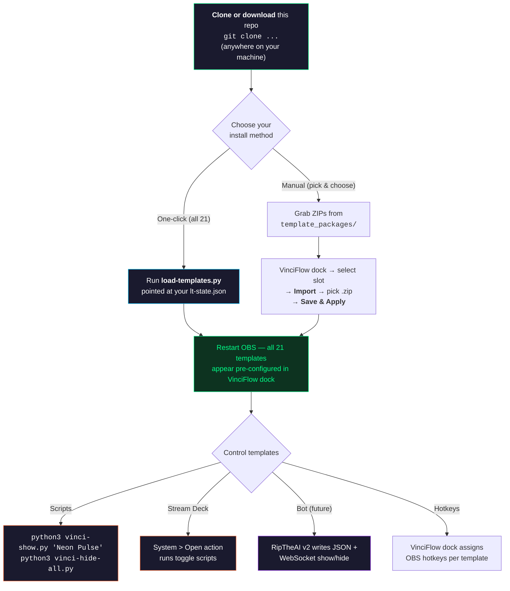

# NooRotic Stream Themes

21 broadcast-grade lower third templates for [VinciFlow](https://github.com/mmlTools/vinci-flow) — with live data injection, WebSocket control scripts, and a browser-based preview tool.

## How It Works



## Prerequisites

- [OBS Studio](https://obsproject.com/) 29+ (Windows 64-bit)
- [VinciFlow plugin](https://streamrsc.com/streaming-resource/vinci-flow) installed
- Python 3.10+ (for loader and control scripts)

## Quick Start

### Option A — Load all 21 templates at once (recommended)

```bash
git clone https://github.com/NooRotic/noorotic-stream-themes.git
cd noorotic-stream-themes

# Inject all templates into VinciFlow (creates backup automatically)
python3 load-templates.py "C:\Program Files\obs-studio\data\themes\default\lt-state.json"

# Restart OBS — all 21 templates appear in VinciFlow dock, pre-configured
```

### Option B — Import individual ZIPs

1. Download or clone this repo
2. Open OBS → VinciFlow dock → select a lower third slot
3. Click **Import** → select a `.zip` from `template_packages/`
4. Click **Save & Apply**

### Option C — Build from source

```bash
./build.sh              # Build all 21 ZIPs
./build.sh neon-pulse   # Build a specific theme
```

## Control Scripts

Python scripts that talk to VinciFlow via OBS WebSocket (port 4455). No external dependencies.

```bash
# List all lower thirds with IDs and visibility
python3 scripts/vinci-list.py

# Hide everything
python3 scripts/vinci-hide-all.py

# Show / hide / toggle by name
python3 scripts/vinci-show.py "Perfect Game Alert"
python3 scripts/vinci-hide.py "Perfect Game Alert"
python3 scripts/vinci-toggle.py "NooRotic Live"
```

Works from Windows natively (`127.0.0.1`) or from WSL (auto-detects Windows host gateway).

### Stream Deck Integration

Map any script to a Stream Deck button via **System > Open**:

| Button | Action |
|---|---|
| "Hide All" | `python3 C:\path\to\scripts\vinci-hide-all.py` |
| "Scoreboard" | `python3 C:\path\to\scripts\vinci-toggle.py "NooRotic"` |
| "Breaking" | `python3 C:\path\to\scripts\vinci-show.py "Breaking Update"` |

Or use VinciFlow's built-in OBS hotkeys — assign in the dock, map to Stream Deck hotkey actions.

## Repo Structure

```
noorotic-stream-themes/
  template_sources/       Source files (HTML/CSS/JSON per theme)
  template_packages/      Ready-to-import ZIP files (21 themes)
  scripts/                WebSocket control scripts
    vinci_ws.py           OBS WebSocket client (stdlib only)
    vinci-list.py         List all lower thirds
    vinci-hide-all.py     Hide everything visible
    vinci-show.py         Show by name or ID
    vinci-hide.py         Hide by name or ID
    vinci-toggle.py       Toggle by name or ID
  viewer/
    index.html            Browser preview tool
  load-templates.py       Bulk inject into lt-state.json
  build.sh                Package sources into ZIPs
```

## Themes

### Button Themes (compact, positioned anywhere)

| Theme | Style | Animated | Avatar |
|---|---|---|---|
| `network-bar` | CNN/Fox-style bottom bar, cyberpunk matrix palette | - | No |
| `anchor-card` | Dark card with avatar circle and left color stripe | - | Yes |
| `corporate-clean` | Light card, shadow, bottom accent gradient | - | Yes |
| `breaking-news` | Red pulsing BREAKING badge, high contrast | Pulse | No |
| `lower-doc` | Documentary dark bar, large title, fade-out rule | - | No |
| `breaking-bowltv` | BowlTV-branded breaking news with logo | Pulse | No |
| `neon-pulse` | Glowing border, breathing drop-shadows, neon flicker | Heavy | No |
| `tiedye-trip` | Psychedelic tie-dye swirl, rainbow text, color cycling | Heavy | No |
| `headline-ticker` | Auto-cycling headlines, orbiting glow, LIVE badge | Heavy | No |

### Specialty Themes (interactive, data-driven)

| Theme | Style | Data Bindings |
|---|---|---|
| `scoreboard` | Dual-team scoreboard with glowing digits, VS center, ticker | `team1`, `team2`, `score1`, `score2`, `round`, `status` |
| `poll-results` | 4-option live poll with animated progress bars | `opt1label`, `opt1pct`, `opt2label`, `opt2pct`, etc. |
| `countdown` | Self-contained timer with blinking colons and progress bar | `target` (ISO date) or `duration` (seconds) |

### Wide Themes (full-width, bottom of screen)

Each button theme has a `-wide` variant that spans the full screen width with:
- Original card embedded on the left
- Static headline area
- Scrolling ticker bar underneath with branded label

| Theme | Ticker Style |
|---|---|
| `network-bar-wide` | Matrix green LIVE ticker |
| `breaking-news-wide` | Red ALERT ticker bar |
| `breaking-bowltv-wide` | Cyan BOWLTV gradient ticker |
| `neon-pulse-wide` | Neon-glowing ticker text |
| `tiedye-trip-wide` | Rainbow animated ticker bar |
| `anchor-card-wide` | Blue NOW ticker |
| `corporate-clean-wide` | Gradient INFO ticker |
| `lower-doc-wide` | Warm italic documentary ticker |
| `headline-ticker-wide` | UPDATE ticker with rotating headlines |

## Live Data

Templates support real-time data injection. External apps write JSON to `parameters_lt_<ID>.json` and the DOM updates automatically via `data-` attribute binding:

```html
<span data-score></span>
<span data-player></span>
```

**Scoreboard example:**
```json
{ "team1": "NooRotic", "score1": "245", "team2": "Opponent", "score2": "198", "round": "Frame 8" }
```

**Countdown example:**
```json
{ "target": "2026-03-22T21:00:00" }
```

**Headline rotation:**
```json
{ "headlines": "First headline|Second headline|Third" }
```

**Scrolling ticker (wide themes):**
```json
{ "ticker": "Breaking news — Live update — More details coming" }
```

## Viewer

Open `viewer/index.html` in any browser — no build step, no OBS required.

- Live preview of all 21 themes with adjustable controls
- Side-by-side comparison mode
- Animation playback (entrance/exit + CSS loops)
- Copy CSS/HTML to clipboard

## Theme Source Structure

Each theme in `template_sources/` is a folder with three files:

```
theme-name/
  template.html   # HTML fragment (inside <li id="{{ID}}">)
  template.css    # Styles scoped to #{{ID}}
  template.json   # Metadata + defaults for VinciFlow import
```

## License

MIT
