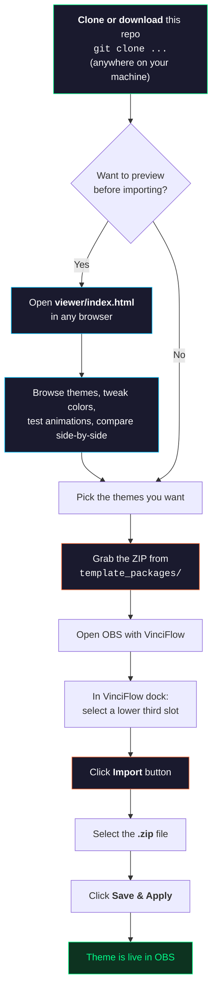

# NooRotic Stream Themes

Custom lower third templates for [VinciFlow](https://github.com/mmlTools/vinci-flow) — a broadcast-grade stream graphics controller for OBS Studio.

## How It Works

VinciFlow imports themes as **ZIP packages** through its dock UI. This repo contains the source files and pre-built packages ready to import.



## Prerequisites

- [OBS Studio](https://obsproject.com/) 29+ (Windows 64-bit)
- [VinciFlow plugin](https://streamrsc.com/streaming-resource/vinci-flow) installed

## Quick Start

**Option A — Use pre-built packages (easiest):**

1. Download or clone this repo
2. Open OBS, go to the VinciFlow dock
3. Select a lower third slot (or create a new one)
4. Click **Import** and select a `.zip` from `template_packages/`
5. Click **Save & Apply** — done

**Option B — Build packages from source:**

```bash
git clone https://github.com/NooRotic/noorotic-stream-themes.git
cd noorotic-stream-themes

# Build all ZIP packages
./build.sh

# Or build a specific theme
./build.sh neon-pulse scoreboard

# Packages appear in template_packages/
```

Then import the `.zip` files through VinciFlow's dock UI.

> **Note:** VinciFlow imports themes into its internal state — you don't copy files to OBS directories. Each import applies to the currently selected lower third slot.

## Repo Structure

```
noorotic-stream-themes/
  template_sources/         <-- Source files (HTML/CSS/JSON per theme)
    neon-pulse/
    scoreboard/
    ...
  template_packages/        <-- Ready-to-import ZIP files
    neon-pulse.zip
    scoreboard.zip
    ...
  viewer/
    index.html              <-- Browser preview tool (no OBS needed)
  build.sh                  <-- Builds ZIPs from sources
```

## Themes

### Button Themes (compact, positioned anywhere)

| Theme | Style | Animated | Avatar |
|---|---|---|---|
| `network-bar` | CNN/Fox-style bottom bar, cyberpunk matrix palette | - | No |
| `anchor-card` | Dark card with avatar circle and left color stripe | - | Yes |
| `corporate-clean` | Light card, shadow, bottom accent gradient | - | Yes |
| `breaking-news` | Red pulsing BREAKING badge, high contrast | Pulse | No |
| `lower-doc` | Documentary dark bar, large title, fade-out rule | - | No |
| `breaking-bowltv` | BowlTV-branded breaking news with logo | Pulse | No |
| `neon-pulse` | Glowing border, breathing drop-shadows, neon flicker | Heavy | No |
| `tiedye-trip` | Psychedelic tie-dye swirl, rainbow text, color cycling | Heavy | No |
| `headline-ticker` | Auto-cycling headlines, orbiting glow, LIVE badge | Heavy | No |

### Specialty Themes (interactive, data-driven)

| Theme | Style | Data Bindings |
|---|---|---|
| `scoreboard` | Dual-team scoreboard with glowing digits, VS center, ticker | `team1`, `team2`, `score1`, `score2`, `round`, `status` |
| `poll-results` | 4-option live poll with animated progress bars | `opt1label`, `opt1pct`, `opt2label`, `opt2pct`, etc. |
| `countdown` | Self-contained timer with blinking colons and progress bar | `target` (ISO date) or `duration` (seconds) |

### Wide Themes (full-width, bottom of screen)

Each button theme has a `-wide` variant that spans `100vw` with:
- Original card embedded on the left
- Static headline area
- Scrolling ticker bar underneath with branded label

| Theme | Ticker Style |
|---|---|
| `network-bar-wide` | Matrix green LIVE ticker |
| `breaking-news-wide` | Red ALERT ticker bar |
| `breaking-bowltv-wide` | Cyan BOWLTV gradient ticker |
| `neon-pulse-wide` | Neon-glowing ticker text |
| `tiedye-trip-wide` | Rainbow animated ticker bar |
| `anchor-card-wide` | Blue NOW ticker |
| `corporate-clean-wide` | Gradient INFO ticker |
| `lower-doc-wide` | Warm italic documentary ticker |
| `headline-ticker-wide` | UPDATE ticker with rotating headlines |

## Theme Source Structure

Each theme in `template_sources/` contains three files:

```
theme-name/
  template.html   # HTML fragment (goes inside <li id="{{ID}}">)
  template.css    # Styles scoped to #{{ID}}
  template.json   # Metadata + default values for VinciFlow import
```

The `build.sh` script packages these into ZIP files that VinciFlow can import.

## Live Data

Templates support live data injection via VinciFlow's parameter system. External apps write JSON to `parameters_lt_<ID>.json` and the template DOM updates automatically via `data-` attribute binding:

```html
<span data-score></span>
<span data-player></span>
```

The `headline-ticker` themes support JS-driven headline rotation — feed pipe-separated headlines:
```json
{ "headlines": "First headline|Second headline|Third" }
```

Wide themes support scrolling ticker text via the `data-ticker` binding:
```json
{ "ticker": "Breaking news — Live update — More details coming" }
```

## Placeholders

All templates use VinciFlow's placeholder substitution system:

| Placeholder | Purpose |
|---|---|
| `{{ID}}` | Unique lower third ID |
| `{{TITLE}}` | Main title text |
| `{{SUBTITLE}}` | Subtitle text |
| `{{PROFILE_PICTURE_URL}}` | Avatar image URL |
| `{{PRIMARY_COLOR}}` / `{{SECONDARY_COLOR}}` | Accent colors |
| `{{TITLE_COLOR}}` / `{{SUBTITLE_COLOR}}` | Text colors |
| `{{OPACITY}}` | Background opacity (0-100) |
| `{{RADIUS}}` | Border radius in px |
| `{{FONT_FAMILY}}` | Font family name |
| `{{TITLE_SIZE}}` / `{{SUBTITLE_SIZE}}` | Font sizes in px |
| `{{AVATAR_WIDTH}}` / `{{AVATAR_HEIGHT}}` | Avatar dimensions |
| `{{ANIM_IN}}` / `{{ANIM_OUT}}` | animate.css class names |

## Viewer

A standalone HTML preview tool lives at `viewer/index.html`. Open it in any browser — no build step required.

Features:
- Live preview of all 21 themes with adjustable controls
- Side-by-side comparison mode
- Animation playback (entrance/exit + CSS loops)
- Copy CSS/HTML to clipboard

## License

MIT
